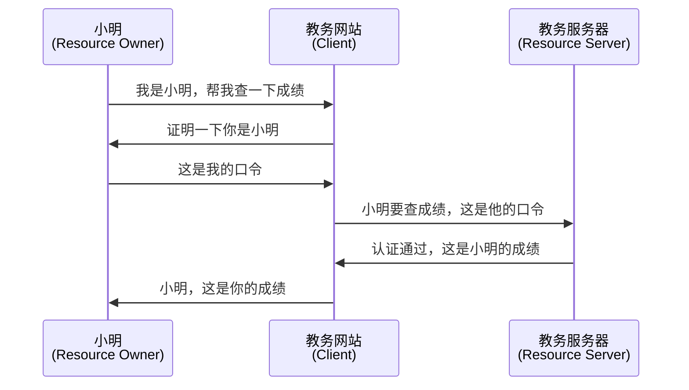
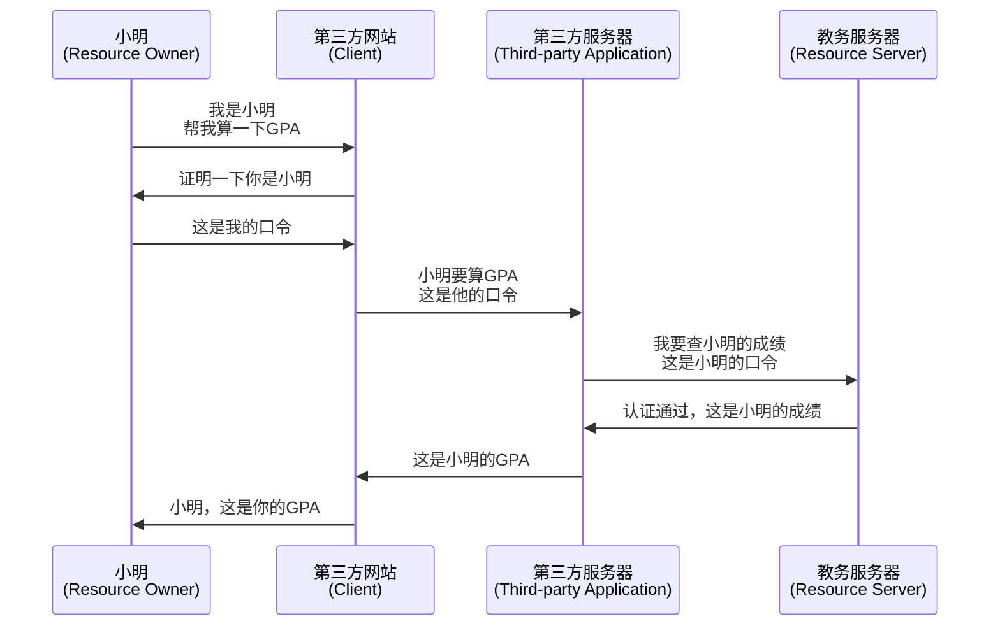
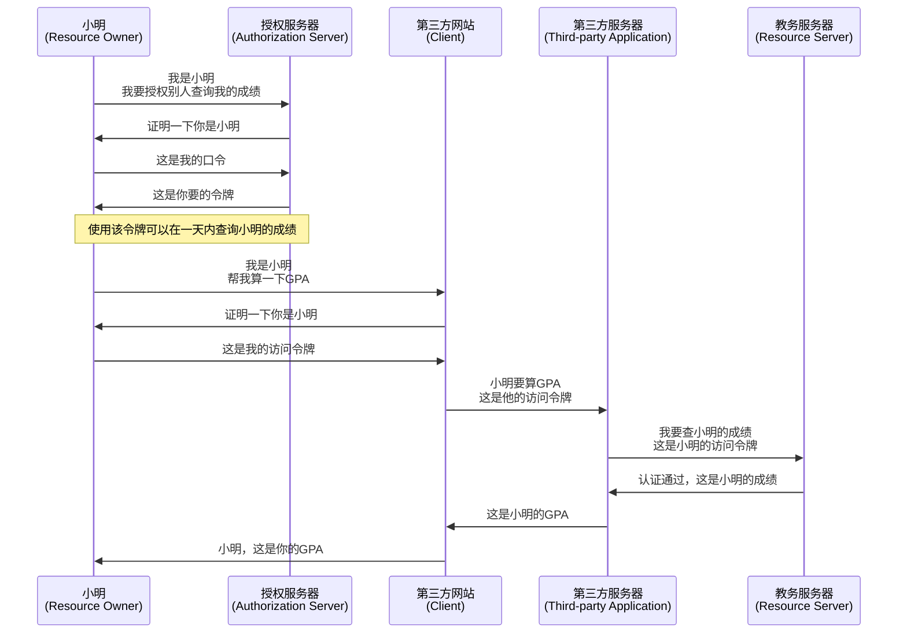
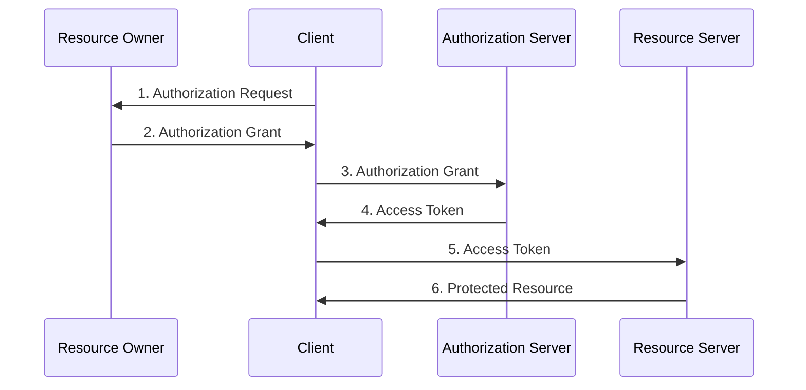



参考资料：

- The OAuth 2.0 Authorization Framework
    http://www.rfcreader.com/#rfc6749
    文中所有英文描述（除特别注明外）均引自该文档。



## THEORY

在传统的Client-Server认证模型中，客户端（Client）向服务器（Server）请求受保护的资源时，需要提供资源所有者（Resource Owner）的用户名和口令（就是我们常说的密码；也可能是其他的credentials，通常是口令）。



当需要第三方服务访问受保护的资源时，资源所有者则需要将用户名和口令提供给第三方服务。



这样的认证模式存在一些安全性问题：
- 资源服务器需要支持基于口令的身份认证
- 资源所有者需要在以下方面足够信任第三方应用
  - 第三方应用不会存储自己的口令，或者
  - 第三方应用会存储自己的明文口令以备将来使用，但是
    - 第三方应用不会在未经授权的情况下，使用口令获取信息（比如查询小明的联系电话）或者进行其他活动（比如给小明退课）
    - 第三方应用足够安全（如果攻击者得到了该应用的数据库，可能导致小明的口令被泄露给攻击者）
- 资源所有者只有通过更改口令才能撤销对第三方应用的授权，且当更改口令时所有的第三方应用将同时失效，无法有针对性地撤销对某一个应用的授权。

所以我们引入**访问令牌**（Access Token）。第三方客户端可以获得一个访问令牌（Access Token），令牌上附有使用该令牌可以在多长时间范围内访问哪些资源等信息。使用该访问令牌可以向资源服务器请求受保护的资源。



例如，在Github中就有[Personal Access Token](https://docs.github.com/en/github/authenticating-to-github/creating-a-personal-access-token)就提供了类似于这种模式的认证。

### OAuth 中的角色

- **资源所有者**（resource owner）
  An entity capable of granting access to a protected resource.  When the resource owner is a person, it is referred to as an end-user.
- **资源服务器**（resource server）
  The server hosting the protected resources, capable of accepting and responding to protected resource requests using access tokens.
- **客户端**（client）
  An application making protected resource requests on behalf of the resource owner and with its authorization.  The term "client" does not imply any particular implementation characteristics (e.g., whether the application executes on a server, a desktop, or other devices).
- **认证服务器**（authorization server）
  The server issuing access tokens to the client after successfully authenticating the resource owner and obtaining authorization.

<!-- The interaction between the authorization server and resource server is beyond the scope of this specification. -->
<!-- The authorization server may be the same server as the resource server or a separate entity. A single authorization server may issue access tokens accepted by multiple resource servers. -->

### OAuth 抽象协议流程



1. 客户端向资源所有者请求授权。可以直接向资源所有者提出授权请求（如图所示），或者最好通过授权服务器作为中介间接进行授权。
2. 客户端收到授权许可。授权许可是表示资源所有者授权的凭据，这个凭据有各种不同的表示形式。使用哪种形式授权取决于客户端请求授权所使用的方法以及授权服务器支持的类型。
3. 客户端通过与授权服务器进行身份认证（验证客户端的身份）并提供凭据（证明已经得到资源所有者的授权许可）来请求访问令牌。
4. 授权服务器对客户端进行身份认证，并且验证授权许可。如果授权许可是有效的，则给客户端发放对应的访问令牌。
5. 客户端向资源服务器出示访问令牌，请求获取受保护的资源
6. 资源服务器验证访问令牌。如果访问令牌是有效的，则提供要求的服务。



区分认证（Authentication）和授权（Authorization）

认证是确认一个实体的身份的过程，授权是确认该实体能做出的动作的过程。以疫情期间进入学校为例。查验一个人的学生证并比对照片的过程是为了确认这个人是学生（认证），查验他的短信和交我办上的入校许可是为了确认这个学生有进入学校的权限（授权）。

OAuth做的是Authorization，OpenID做的是Authentication。



## Practice

### 以i.sjtu.edu.cn为例观察jAccount的认证和授权流程

从首页上获取jAccount认证的入口



其链接为 https://i.sjtu.edu.cn/jaccountlogin ，点击该链接可以看到页面跳转到了 jaccount.sjtu.edu.cn 下的身份认证页面。利用Python查询跳转历史。

``` python
import httpx

entry_point = 'https://i.sjtu.edu.cn/jaccountlogin'

with httpx.Client() as client:
    resp = client.get(entry_point)
    for r in resp.history:
        print(r.url)

    print(resp.url)

```

```
https://i.sjtu.edu.cn/jaccountlogin
https://jaccount.sjtu.edu.cn/oauth2/authorize?scope=essential&response_type=code&redirect_uri=http%3A%2F%2Fi.sjtu.edu.cn%2Fjaccountlogin&client_id=MVJGw8u0bzoMJVbfb4Fk
https://jaccount.sjtu.edu.cn/jaccount/jalogin?sid=jaoauth220160718&client=CLaY6dLZ1oTGA7PeX6O0ZvkydDeYeCh1W8y6fOzYSy5F&returl=CMG1Z60lChyMcBee8%2Bp5qk8qRGTnGRvnVdaTVz6u0E%2FtqVHWOxmZG4y7SqGJQfRy2mmBzse%2FZ1ymtO67lTUhHGJr4VCJEpE28Fap016tcphY4X1zIhVRfEejfyGIoJ%2BZBQ%3D%3D&se=CJSNLdgVZ8TOpAl7Utu3Qqu0qSkPZ0qNdLPqIjGhEntjPz9fIVo8Jt4WS23Nrte5zA%3D%3D
```

可以看到页面首先重定向到了`https://jaccount.sjtu.edu.cn/oauth2/authorize`请求授权，在授权过程中通过页面`https://jaccount.sjtu.edu.cn/jaccount/jalogin`对用户进行身份认证（要求用户提交用户名和密码）。

#### Authorize

其中`/oauth2/authorize`的请求参数如下：

``` json
{
    "scope": "essential",
    "response_type": "code",
    "redirect_uri": "http://i.sjtu.edu.cn/jaccountlogin",
    "client_id": "MVJGw8u0bzoMJVbfb4Fk"
}
```


[`response_type`](https://tools.ietf.org/html/rfc6749#section-3.1.1)键指定了授权的形式。其值为`code`表明授权形式为[Authorization Code](https://tools.ietf.org/html/rfc6749#section-4.1)。

[`client_id`](https://tools.ietf.org/html/rfc6749#section-2.2)键指定了请求jAccount授权的客户端ID。

[`redirect_uri`](https://tools.ietf.org/html/rfc6749#section-3.1.2)键指定了授权成功后的跳转链接。

[`scope`](https://tools.ietf.org/html/rfc6749#section-3.3)键指定了授权范围。在[开发文档](http://developer.sjtu.edu.cn/wiki/APIs#API_Scopes)中可以看到，essential使教务处能读取用户的基本标识和姓名，以及帐号绑定的身份的信息（包括身份id，身份类型和身份所属部门院系）。具体包括以下内容

``` json
{
  "id":{guid},                      // 无意义的唯一id
  "account":{string},               // jaccount, 帐号名
  "name":{string},                  // 真实姓名
  "kind":"canvas.profile",
  "code":{string},                  // 默认身份学/工号
  "userType": {string},             // 默认身份用户类型，同步自统一授权，主要包括：faculty, student
  "organize":{                      // 默认身份所属机构
    "id":{string},
    "name":{string}                 // 组织机构名
  },
  "timeZone": {int},                // 用户所在时区，默认+8
  "identities":[nicman.identity]    // 帐号绑定身份信息,
}
```

#### Authenticate

模拟填写表单进行jAccount登录

``` python
import json
from io import BytesIO
from time import time
from urllib.parse import parse_qsl, urlparse

import httpx
from bs4 import BeautifulSoup
from PIL import Image

entry_point = 'https://i.sjtu.edu.cn/jaccountlogin'

with httpx.Client() as client:
    resp = client.get(entry_point)

    url_ql = dict(parse_qsl(resp.url.query))

    soup = BeautifulSoup(resp.content, 'html.parser')

    form = dict([
        (e.get('name'), e.get('value'))
        for e in soup.find('form', id='form-input').find_all('input')
        if e.get('type') != 'submit'
    ])

    captcha_resp = client.get(resp.url.join(f'captcha?'), params={
        'uuid': form["uuid"],
        't': int(time()*1000)
    })
    captcha_fp = BytesIO(captcha_resp.content)
    captcha_img = Image.open(captcha_fp).convert('L')
    width, height = captcha_img.size
    for y in range(0, height):
        for x in range(0, width):
            pixel = captcha_img.getpixel((x, y))
            if pixel > 225:
                print(' ', end='')
            else:
                print('*', end='')
        print('')

    form['user'] = input('Input your username: ').strip()
    form['pass'] = input('Input your password: ').strip()
    form['captcha'] = input('Input the Captcha: ').strip()

    auth_resp = httpx.post(
        'https://jaccount.sjtu.edu.cn/jaccount/ulogin', data=form)

    if auth_resp.url.host == 'jaccount.sjtu.edu.cn':
        if 'err' in dict(parse_qsl(auth_resp.url.query)):
            soup = BeautifulSoup(auth_resp.content, 'html.parser')
            msg = soup.find('div', id='div_warn').text
            print(msg)
        else:
            print('Unknown error')
    else:
        for r in auth_resp.history.copy() + [auth_resp]:
            print(r.request.method, r.status_code, r.url, sep='\t')
```

由于可能涉及到隐私信息，就不贴出运行结果了。可以从输出中看到在`jaccount.sjtu.edu.cn`经过一系列跳转后，最终访问了之前设定的返回地址，并且加上了授权码`code`参数。




注：此处应该还有一个web页面，需要用户显式同意授权`i.sjtu.edu.cn`访问用户的essential信息，但是因为我已经授权过了（并且我找不到在哪里取消授权）所以这里就不会再提示授权。




```
http://i.sjtu.edu.cn/jaccountlogin?code={Authorization Code}
```

`i.sjtu.edu.cn`就可以使用这一授权码获取essential信息。

